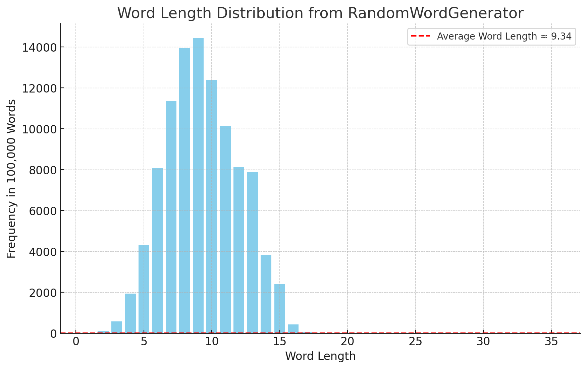

# EPL231 GroupAssignment (Group 28)

## Project Overview
This project implements a search engine and data structure utilities using Java. The system uses Tries, Robin Hood Hashing, and a MinHeap to store and process data efficiently. The functionality includes loading dictionaries, validating word presence, processing scripts, and finding relevant words based on various criteria.

## Components

### Main Class: `Main`
- Entry point of the application.
- Accepts command-line arguments for dictionary and script file paths.
- Steps:
  1. Loads a dictionary into a Trie.
  2. Validates the dictionary entries.
  3. Processes a script file.
  4. Starts the search engine.

### Utility Classes

#### 1. `BatchTrieTest`
- Automates the process of testing Tries with varying input sizes.
- Measures memory usage and writes averages to an output file.

#### 2. `DictionaryLoader`
- Handles the loading and validation of dictionary files.
- Supports processing script files and cleaning input data.

#### 3. `SearchEngine`
- Provides user interaction to search for words and their alternatives.
- Implements three criteria to find relevant words:
  1. Matching words.
  2. Words differing by two characters.
  3. Valid words based on input length.
- Uses a `MinHeap` to prioritize and display results.

#### 4. `MinHeap`
- Data structure to store strings along with their importance values.
- Ensures efficient retrieval of the least important elements in order to update the heap with the most important elements.

#### 5. `RobinHoodHashing`
- Implements hash-based storage with Robin Hood hashing.
- Includes insertion, search, and rehashing functionalities.

#### 6. `Element`
- Represents an element in a hash table.
- Attributes:
  - `key`: Character key.
  - `importance`: Integer importance.
  - `node`: Reference to a TrieNode.

#### 7. `TrieNode` and `TrieNodeStatic`
- Core data structures for the Trie:
  - `TrieNode` supports dynamic insertion and search.
  - `TrieNodeStatic` provides static implementation and memory calculations.
- Stores words, validates presence, and computes memory usage.

#### 8. `FixedLengthWordGenerator` and `RandomWordGenerator`
- **FixedLengthWordGenerator**:
  - Generates a specified number of random words, all of a fixed length.
  - Saves the generated words into a text file in the specified directory.
  - Ensures directories are created if they don't already exist.

- **RandomWordGenerator**:
  - Generates random words with lengths determined probabilistically.
  - Uses cumulative probabilities to decide the word length.
  - Saves the generated words to a text file in the specified directory.
  - Supports flexible word generation for varying lengths.

#### Word Length Distribution

The chart below illustrates the distribution of word lengths generated using the **RandomWordGenerator**, showing that the average word length is approximately 9.34:



## Execution

### Requirements
- Java 8 or later.
- Input files (dictionary and script).

### Compilation
```bash
javac *.java
```

### Running the Program
```bash
java Main <dictionaryFile> <scriptFile>
```
Example:
```bash
java Main "./Dictionaries/Plan Example/planDict.txt" "./Dictionaries/Plan Example/planScript.txt"
```


## File Structure
- `Main.java`: Entry point.
- `BatchTrieTest.java`: Automation of Trie tests.
- `DictionaryLoader.java`: Handles dictionary operations.
- `SearchEngine.java`: Search-related operations.
- `MinHeap.java`: Min-Heap implementation.
- `RobinHoodHashing.java`: Hash table implementation.
- `Element.java`: Represents hash table elements.
- `TrieNode.java` / `TrieNodeStatic.java`: Trie implementations.
- `FixedLengthWordGenerator.java`: Generates fixed-length words.
- `RandomWordGenerator.java`: Generates random words with varying lengths.

## Memory Analysis
- `BatchTrieTest` provides memory usage statistics for different Trie sizes.
- Static memory usage calculations:
  - `TrieNodeStatic`: 112 bytes per node.
  - `TrieNode`: Dynamic based on Robin Hood hash size.

## Limitations
- Only supports ASCII character sets.
- Dictionary and script files must follow specific formats.


## Sources
### Average English Word Length Distribution
- https://www.thefreelibrary.com/On%2Bword-length%2Band%2Bdictionary%2Bsize.-a0189832222?utm_source=chatgpt.com
### 466k English Word Dictionary
- https://github.com/dwyl/english-words
